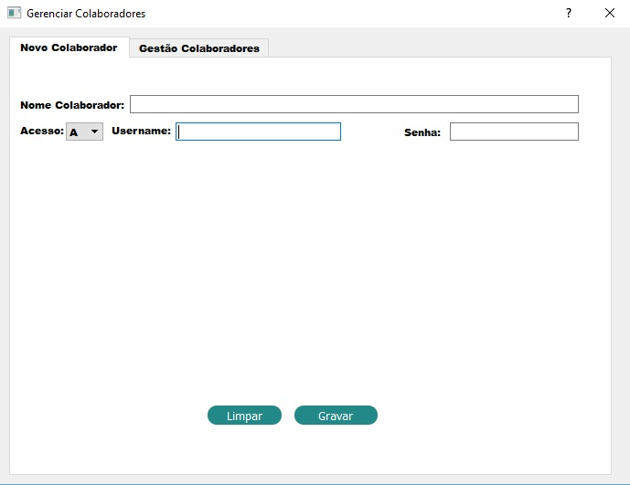

# Almoxarifado-Inteligente

## Visão Geral 
Com o crescimento de grandes empresas no mercado de trabalho e económico, pensamos em um projeto que remetesse aos dias atuais, como a implementação de um almoxarifado inteligente. Que o usuário possa ter total controle de tudo que estivesse entrando e saindo no seu estoque, como demais utilizações, por meio de interfaces lógicas e usuais.

## Introdução
A aplicação deve permitir que o usuário insira vários Colaboradores de diferentes níveis de acesso, podendo ir desde apenas visualização dos itens presentes no almoxarifado até a adição de novos itens, remoção de itens ou até mesmo cadastro de novos colaboradores.
Contando também com um sistema de segurança abrangendo temperatura, controle de iluminação sensor de presença e fechadura eletrônica tudo integrado ao sistema com visualização via web.

## Instalação

Extrair arquivos, mover pasta **almoxarifado** para a pasta do **QT**, ao executar o programa será criada uma pasta **build** onde deve-se colar a pasta **db** presente na pasta **almoxarifado** para a pasta **build/debug**.

**Local da pasta db**

A Figura abaixo mostra a tela inicial da aplicação.

Tela de Login.

## Login

O usuário deve efetuar o login na tela inicial que irá aparecer logo após  abertura do programa. Sendo necessário inserir nome de usuário e senha previamente cadastrados.
 Ex:  Login – joarles 
      Senha - 123

## Níveis de Acesso

Após ser efetuado o login será informado ao usuário qual seu nível de acesso.

OBS: Caso o usuário tente acessar alguma opção na qual o seu acesso não permite será informado uma mensagem **Acesso não Permitido!**

## Nível de Acesso C
Caso o usuário possua nível de acesso **C**, poderá ir apenas para Lista de Itens clicando no botão **Ver Itens**, onde verá todas as informações do item, desde seu nome até data/hora de entrada e clicando nas abas é possível ordenar os itens!

## Nível de Acesso B
Caso o usuário possua nível de acesso **B**, além da visualização dos itens ele poderá abrir a aba **estoque**, desta forma inserir um novo item ou alterar a sua quantidade na aba **gestão produtos**.

## Nível de Acesso A

O usuário de acesso **A** além das demais funções liberadas possui também a possibilidade de alterar qualquer característica do item, adicionar/remover um colaborador ou alterar o nível de acesso do colaborador.

**Adicionando um novo colaborador**

**Alterando um colaborador existente**

Caso algum usuário sem a permissão para tal função tente executa-la será exibida a informação **acesso não permitido**.

### Informações

A comunição do QT com o SQLite  é feita através da função *prepare*, utilizando dos parâmetros **insert**, **update**, **delete**, **select** para informar o que fazer com os dados.

**Parâmetro Insert**

Utilizado para inserir todos os dados na tabela.

**Parâmetro Update**

Utilizado para atualizar a tabela sempre que ocorrer alguma alteração.

**Parâmetro delete**

Utilizado para excluir um item da tabela inserida no SQLite.

**Parâmetro Select**

Utilizado para carregar os dados do SQL para o QT.

**Interface Web**

É possível verificar a temperatura atual do local, controlar a fechadura da porta e visualizar a presença de indivíduos no ambiente.

**Esquematico do Circuito**

**Materiais Utilizados**

*NodeMcu ESP8266 - O módulo Wifi ESP8266 NodeMCU é uma placa de desenvolvimento que combina o chip ESP8266, uma interface usb-serial e um regulador de tensão 3.3V. A programação pode ser feita usando LUA ou a IDE do Arduino. 

*Sensor Temperatura DHT11 - O DHT11 é um sensor de temperatura e umidade que permite fazer leituras de temperaturas entre 0 a 50 Celsius e umidade entre 20 a 90%.

*Sensor de Presença PIR - O Sensor de Movimento PIR DYP-ME003 consegue detectar o movimento de objetos que estejam em uma área de até 7 metros! Caso algo ou alguém se movimentar nesta área o pino de alarme é ativado.

*Led - Componente para um projeto que necessita de uma fonte de luz ou algum efeito de sinalização. Ele é formado por um material semicondutor, que emite luz quando uma tensão é aplicada aos seus terminais.

*Resistor 220 volts - utilizado em ambiente de testes e reparo de circuitos eletrônicos em geral.

**Obrigado por utilizar o Almoxarifado Inteligente!**

