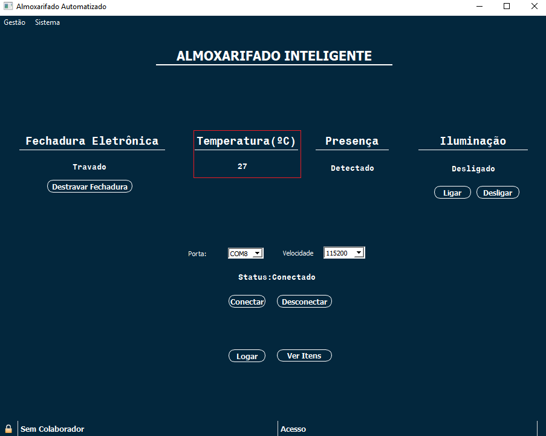

# Almoxarifado Inteligente

## Visão Geral 
Com o crescimento de grandes empresas no mercado de trabalho e económico, pensamos em um projeto que remetesse aos dias atuais, como a implementação de um almoxarifado inteligente. Que o usuário possa ter total controle de tudo que estivesse entrando e saindo no seu estoque, como demais utilizações, por meio de interfaces lógicas e usuais.

## Introdução
A aplicação deve permitir que o usuário insira vários colaboradores de diferentes níveis de acesso, podendo ir desde apenas visualização dos itens presentes no almoxarifado até a adição de novos itens, remoção de itens ou até mesmo cadastro de novos colaboradores.
Contando também com um sistema de segurança abrangendo temperatura, controle de iluminação, sensor de presença e fechadura eletrônica, tudo integrado ao sistema com visualização via web e aplicativo para desktop.

## Instalação

Extrair arquivos, mover pasta **almoxarifado** para a pasta do **QT**, ao executar o programa será criada uma pasta **build** onde deve-se colar a pasta **db** presente na pasta **almoxarifado** para a pasta **build/debug**.

**Local da pasta db**

## Tela Inicial do aplicativo ##

Para melhor entendermos o aplicativo, a figura abaixo mostrará a tela padrão do app:

Na tela inicial podemos observar várias informações, tais como a presença, a temperatura, a fechadura eletrônica e a luz, todos contidos almoxarifado. Além disso, visualizamos o botão de entrar e de ver itens. Entretanto, como mais importante, temos a porta USB que iremos conectar nossa ESP8266 e sua velocidade de processamento, visto que, sem essa conexão não irá ter o funcionamento completo do software.

## Conectividade ##

Com o intuito de enviar e receber dados, é necessário a conexão com a placa LoLin(ESP8266), para isso basta selecionarmos qual é a porta USB ela está conectada e, também, determinar sua velocidade de processamento a partir de como foi feito seu código. FEito isso, basta apenas aperta o botão conectar.

Quando a placa conseguir conectar-se com o app, será visualizado "Status: Conectado", informando que a placa está conectada. Para desconectar bastar clicar no botão de desconectar.

## Equipamentos ##

Como dito anteriormente, podemos observar a temperatura do local, uma vez que, poderemos saber se esse lugar está propício para guardar determinados itens. 

Além da temperatura, temos o sensor de presença, que ao detectar o movimento humano, mostrará na tela que detectou algum tipo de movimento.

Para facilitar o acionamento da luz do local, inserimos dois botões que possuem a finalidade de ligar e desligar a luz. Quando ligar, aparecerá que estará ligada, a partir do momento que é desligado, observamos que estará desligada.

Com o intuito de aumentar a segurança do almoxarifado, que essencialmente possuí objetos importantes, foi adicionada uma fechadura eletrônica, que destravará a trava da porta a partir do momento em que o botão de destravar é acionado. Após 5 segundos a porta é travada novamente.

## Login

Com o objetivo de utilizar as outras funções do software, é obrigatório fazer o login, para isso, basta apenas clicar no botão de entrar. Logo após, aparecerá uma janela a qual será necessário inserir nome de usuário e senha previamente cadastrados.
 
 Ex:  Login – gustavo 
      Senha - ehlindo
      

## Níveis de Acesso

Após ser efetuado o login será informado ao usuário qual seu nível de acesso.

OBS: Caso o usuário tente acessar alguma opção na qual o seu acesso não permite será informado uma mensagem **Acesso não Permitido!**

## Nível de Acesso C

Caso o usuário possua nível de acesso **C**, poderá ir apenas para Lista de Itens clicando no botão **Ver Itens**, onde verá todas as informações do item, desde seu nome até data/hora de entrada e clicando nas abas é possível ordenar os itens!

## Nível de Acesso B
Caso o usuário possua nível de acesso **B**, além da visualização dos itens ele poderá abrir a aba **estoque**, desta forma inserir um novo item ou alterar a sua quantidade na aba **gestão produtos**.

## Nível de Acesso A

O usuário de acesso **A** além das demais funções liberadas possui também a possibilidade de alterar qualquer característica do item, adicionar/remover um colaborador ou alterar o nível de acesso do colaborador.

**Adicionando um novo colaborador**

**Alterando um colaborador existente**

Caso algum usuário sem a permissão para tal função tente executa-la será exibida a informação **acesso não permitido**.

### Informações

A comunição do QT com o SQLite  é feita através da função *prepare*, utilizando dos parâmetros **insert**, **update**, **delete**, **select** para informar o que fazer com os dados.

**Parâmetro Insert**

Utilizado para inserir todos os dados na tabela.

**Parâmetro Update**

Utilizado para atualizar a tabela sempre que ocorrer alguma alteração.

**Parâmetro delete**

Utilizado para excluir um item da tabela inserida no SQLite.

**Parâmetro Select**

Utilizado para carregar os dados do SQL para o QT.

## Interface Web ##

A fim de melhorar o sitema do almoxarifado, foi construído um website que é possível visualizar boa parte das funções que o aplicativo possui. Para acessá-lo basta clicar nesse link http://almoxautomated.herokuapp.com/. Como podemos observar na figura, todos as informações já foram vistas, uma vez que, o app e o site podem ser visualizados simultaneamente. 

Com intenção de deixar a página da internet bonita, atraente, e fluída, utilizou-se commo folha de estilo o bootstrap que está presente na barra de navegação superior...

Além do bootstrap foi usado o css, que é um dos mais empregados atualmente para fazer folhas de estilo, uma vez que, o próprio desenvolvedor é quem cria o estilo da página. Para entendermos melhor as próximas figuras mostrarão onde usou-se em alguns trechos do website.

O código em css:

[Imagem Do Código css]

## Esquematico do Circuito ##

## Materiais Utilizados ##

**NodeMcu ESP8266** - O módulo Wifi ESP8266 NodeMCU é uma placa de desenvolvimento que combina o chip ESP8266, uma interface usb-serial e um regulador de tensão 3.3V. A programação pode ser feita usando LUA ou a IDE do Arduino. 

**Sensor Temperatura DHT11** - O DHT11 é um sensor de temperatura e umidade que permite fazer leituras de temperaturas entre 0 a 50 Celsius e umidade entre 20 a 90%.

**Sensor de Presença PIR** - O Sensor de Movimento PIR DYP-ME003 consegue detectar o movimento de objetos que estejam em uma área de até 7 metros! Caso algo ou alguém se movimentar nesta área o pino de alarme é ativado.

**Led** - Componente para um projeto que necessita de uma fonte de luz ou algum efeito de sinalização. Ele é formado por um material semicondutor, que emite luz quando uma tensão é aplicada aos seus terminais.

**Resistor 100 ohms** - utilizado em ambiente de testes e reparo de circuitos eletrônicos em geral.

### Com isso você consegue entender todo o funcionamento do almoxarifado inteligente, dado que, é um ótimo sistema para conseguir organizar o ambiente mais rapidamente. ###

## A você que utiliza o Almoxarifado Inteligente, somos eternamente gratos por contribuir com melhorias em sua empresa. Muito obrigado! ##

